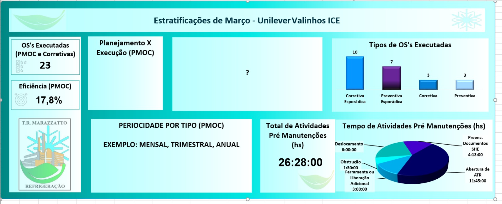

##  T.R. MARAZZATTO DASHBOARD

🇺🇸 Automated program for creating panels, in order to present the performance of PMOC and other Services, from the company T.R. MARAZZATTO to industries such as Unilever and others.

🇧🇷 Programa automatizado para criação de painéis, com o objetivo de apresentar o desempenho do PMOC e outros Serviços, da empresa T.R. MARAZZATTO para indústrias como a Unilever e outras.


#### [License: Apache License Version 2.0 or later](https://www.apache.org/licenses/)

<br/>

#### ```Author: Gustavo Madureira ( gtmadureira@gmail.com )```

<br/>

### ⚠️ ___FOR INTERNAL PURPOSES ONLY___ ⚠️
### 🚧 ___PROGRAM UNDER DEVELOPMENT!___ 🚧

<br/>

## Dependencies

### [Python 3.12](https://www.python.org/downloads/) or higher
### [Git 2.43](https://git-scm.com/downloads) or higher

[Requests Module](https://pypi.org/project/requests/):

    pip install requests

[Stub Module for Requests Module](https://pypi.org/project/types-requests/):

    pip install types-requests

[AudioPlayer Module](https://pypi.org/project/audioplayer/):

    pip install audioplayer

[vext Module](https://pypi.org/project/vext/)

    pip install vext

[vext.gi Module](https://pypi.org/project/vext.gi/):

    pip install vext.gi

[colorama Module](https://pypi.org/project/colorama/):

    pip install colorama

<br/>

### Minimum [RAM requirements](#memory-consumption)

<br/>

## Installation

    git clone https://github.com/gtmadureira/trm-dashboard.git trm-dashboard

<br/>

## Quick Start

#### For macOS/Linux operating system

    python3 -OO dashboard.py

#### For Windows operating system

    python -OO dashboard.py

<br/>

## How It Works

Once the dashboard program is run, and the filters and search features are selected, it will generate and display a dashboard that presents the performance metrics of the PMOC and other Services, with visual representations such as graphs and tables.

<br/>

## Expected Output

Example:



In the future, features on the way/coming soon:

- The dashboard will be user-friendly and easy to navigate;<br/>
&nbsp;&nbsp;&nbsp;&nbsp;&nbsp;&nbsp;&nbsp;&nbsp;&nbsp;&nbsp;&nbsp;&nbsp;updated automatically with the latest data;<br/>
&nbsp;&nbsp;&nbsp;&nbsp;&nbsp;&nbsp;&nbsp;&nbsp;&nbsp;&nbsp;&nbsp;&nbsp;accessible via a web interface.<br/>
&nbsp;&nbsp;&nbsp;&nbsp;&nbsp;&nbsp;And will include a login system for user authentication;<br/>
&nbsp;&nbsp;&nbsp;&nbsp;&nbsp;&nbsp;&nbsp;&nbsp;&nbsp;&nbsp;&nbsp;&nbsp;filters and search functionality for easy data retrieval;<br/>
&nbsp;&nbsp;&nbsp;&nbsp;&nbsp;&nbsp;&nbsp;&nbsp;&nbsp;&nbsp;&nbsp;&nbsp;export options for data in various formats (e.g., CSV, PDF);<br/>
&nbsp;&nbsp;&nbsp;&nbsp;&nbsp;&nbsp;&nbsp;&nbsp;&nbsp;&nbsp;&nbsp;&nbsp;a notification system for alerts and updates;<br/>
&nbsp;&nbsp;&nbsp;&nbsp;&nbsp;&nbsp;&nbsp;&nbsp;&nbsp;&nbsp;&nbsp;&nbsp;a settings section for customization options;<br/>
&nbsp;&nbsp;&nbsp;&nbsp;&nbsp;&nbsp;&nbsp;&nbsp;&nbsp;&nbsp;&nbsp;&nbsp;a contact section for inquiries and support;<br/>
&nbsp;&nbsp;&nbsp;&nbsp;&nbsp;&nbsp;&nbsp;&nbsp;&nbsp;&nbsp;&nbsp;&nbsp;a FAQ section for common questions and answers;<br/>
&nbsp;&nbsp;&nbsp;&nbsp;&nbsp;&nbsp;&nbsp;&nbsp;&nbsp;&nbsp;&nbsp;&nbsp;a community section for user discussions and collaboration;<br/>
&nbsp;&nbsp;&nbsp;&nbsp;&nbsp;&nbsp;&nbsp;&nbsp;&nbsp;&nbsp;&nbsp;&nbsp;a credits section for acknowledgments and attributions;<br/>
&nbsp;&nbsp;&nbsp;&nbsp;&nbsp;&nbsp;&nbsp;&nbsp;&nbsp;&nbsp;&nbsp;&nbsp;and a license section for usage rights and restrictions.

<br/>

## Memory Consumption

The memory consumption stack trace was made by using [mprof](https://pypi.org/project/memory-profiler/) to monitor this program.
